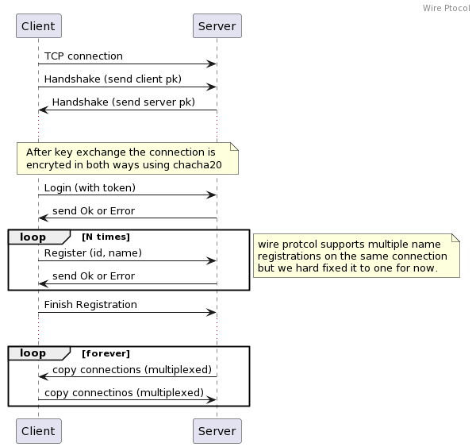

# Wire protocol

The diagram above gives a quick overview of what happens on the wire when a diglett client connects to the server.

Next we will explain the format of each frame that goes over the wire.

## Handshake

The handshake frame is built as follows

| magic | version | key |
|-------|---------|-----|
| 4 bytes| 1 byte | 33 bytes |

- The `magic` is a 4 bytes that always carries the value `0x6469676c` is used to identify that this a valid diglett connection.
- The `version` is a 1 byte that is set for `0x01` for now (version 1). This might change in the future if needed.
- The `key` segment is a 33 bytes long section that carries the `Public Key` of the handshake sender. This key is always a `Secp256k1` public key.

### Handshake process

When the client connects, it starts by sending a handshake frame as defined before. The server replies immediately by sending back also a handshake frame but carries the server
public key instead.

The moment the handshake response is received, both the client and the server agree to a shared key using `ecdh` algorithm. The `shared key` generated is used from this point forward
to encrypt the traffic (both ways) using the `chacha20` symmetric encryption algorithm.

> NOTE: because the client and server exchange keys on the wire, there is no way to validate the server identity hence the system can be prone to `man in the middle` attacks. This can change
in the future to fetch server public key over **https** only.

## Control/Data frame

After the handshake the wire will only use ONE frame format which is as follows
|kind| id | size | payload |
|----|----|------|---------|
| 1 byte | 4 bytes | 2 bytes | variable size |

- the `kind` is one byte, more details on this later.
- the `id` is a 4 bytes identification of the frame. The id itself is split into 2 parts
  - `registration` is the id of the registration that this frame belongs to (as per the registration step above in the sequence diagram)
  - `stream` is the id of the `open connection` which identifies one client connection to the `backend` service.
  - This means that the `id` is not unique because many frames can still belong to the same client connection
- the `size` is 2 bytes which is the size of the payload. this can be `0` for most control frames.

### Frame Kind

Kind tells the server and the client what kind of payload is carried by this frame. Currently we have those kinds

- Ok = 0, is a response to a previous control message that donates success
- Error = 1, is a response to a previous control message that donates failure, the payload then carries the error message
- Register = 2, is a `register` request as per the sequence diagram. The `id` then carries only the registration id in the higher order 2 bytes. The payload then carries the name.
- FinishRegister = 3, as per the sequence diagram this need to be sent after all registration messages. no payload
- Payload = 4, carries actual stream data for clients, the id in this case always carries a unique ID that identifies this client connection the ID is constructed to that it holds (registration, port number) of the client that makes 4 bytes in total
- Close = 5, close a stream, the id then holds the stream (client connection) to close
- Terminate = 6, terminate should terminate the agent, has no payload, also is never used in code so far
- Login = 7, login request as per the sequence diagram, payload then carries the token

> Note: after sending `finish-registration` all following frames on both directions on the wire can only be `payload` or `close` frames.

## So how does this works

If you understand the description of the wire protocol above, then the operation of the server and client becomes simple and it goes as follows:

- client initiate connection, they exchange keys, and start an encrypted stream.
- client login, by sending a token
- server reply with OK, or Error in case authentication error
- client send a register (id, name) we only support one register call for now. Id is normally 0, name is the name of the subdomain to register
- server reply with OK, or Error in case of authorization error
- once client send registration finish, the server then start listening on a random port. (for each registration) we call this `listen port` from now on
  - the `listening port` connections are basically forwarded (multiplexed) over the agent connection to agent side
- when a client connects to the `listen port` and have local port as know as `client socket` and start writing data, a payload frame(s) are sent with the data to the agent.
  - all data coming from the `client` will be of `payload` kind, and `id` as `(<registration>, <local socket>)` this will be the frame id. for example `0x00008269` where registration id is 0 and `client socket` is `33385`
  - that ID from now on is called `stream id`
- when the agent receive a `payload` of an unknown id. A new connection is established to the backend. the connection is then mapped to the stream id.
- the agent also takes care of copying any data over from that backend connection to the server. using the same `stream id`.
- when the server receives any `payload` frame from the agent with that stream id the data is written back to the `client socket`.
- If any of the sides loses the open socket for that stream, a control `close` type is send to the other end so it makes sure the connection is closed and cleaned up.
